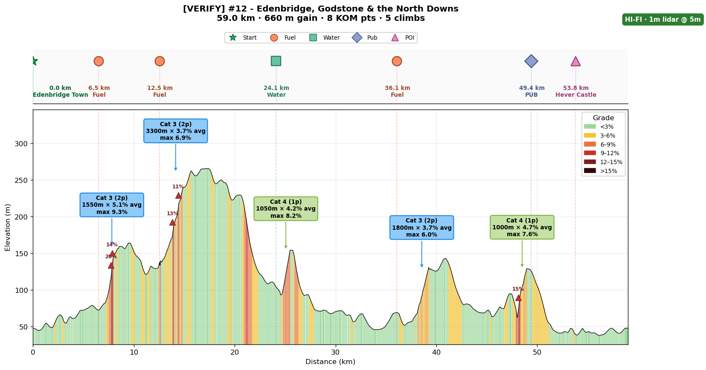
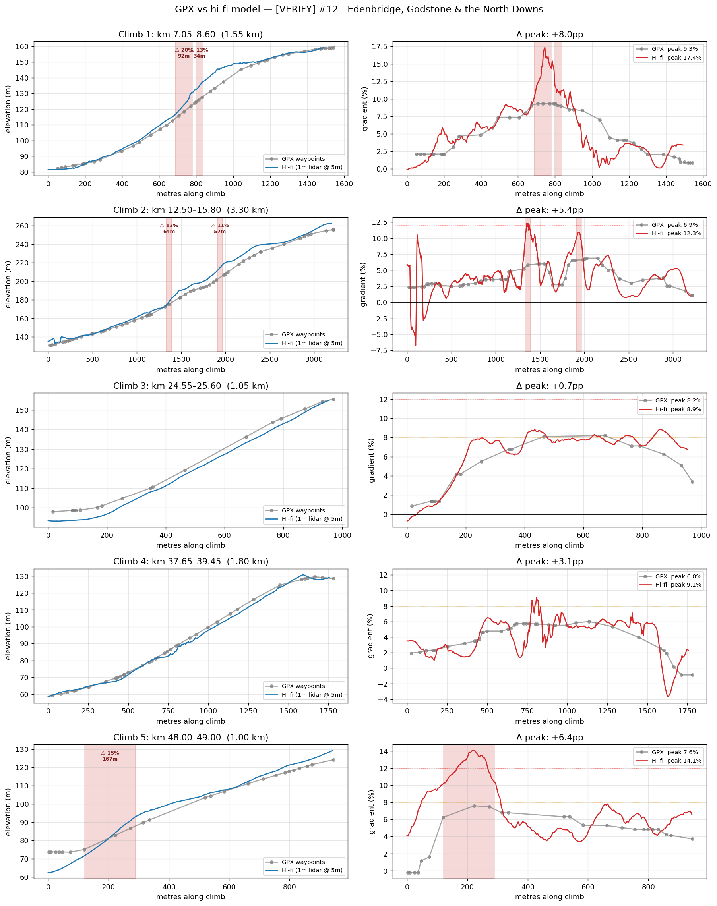
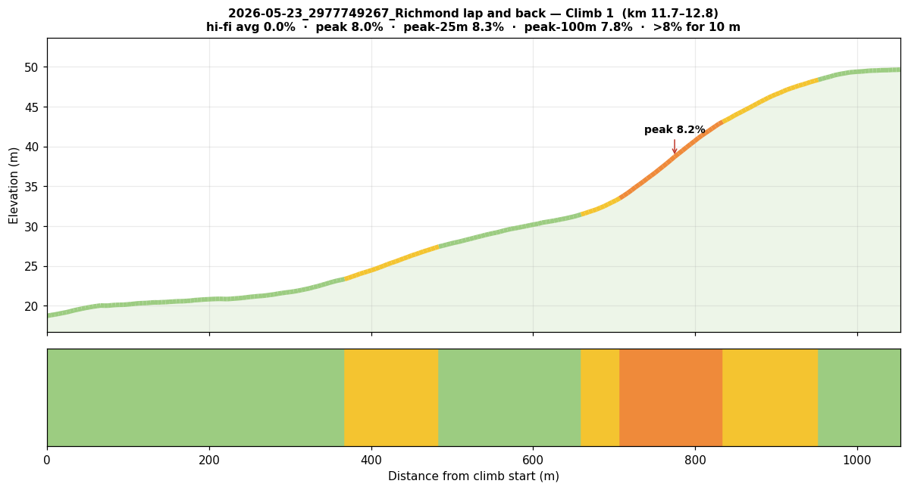

# cycling-analysis-agent

> An AI cycling coach you host yourself — a Claude agent that reads your rides, predicts your routes,
> tracks your form, and verifies every climb against **1-metre LIDAR** so the pacing is actually right.
> A physicist's model with a *directeur sportif's* attitude — and a plan that bends when life doesn't.


<p align="center">
  
  <br><em>A real route, profiled — grade-coloured climbs, UCI categories, a KOM-points total, every gradient re-checked against 1&nbsp;m LIDAR.</em>
</p>

## Why this exists

I'm a self-coached rider, and I wanted a coach that actually knew two things most apps don't: the
**physics** of *my* engine on *my* bikes, and the **real gradient** of the roads I ride. TrainingPeaks
knows my numbers; Strava knows the segments; neither knows that the routing engine flattened the 14%
wall on Leith Hill into a polite 9%, or that I changed my position and dropped my CdA.

So I built one. It reads my rides, predicts my routes, tracks my form — and because it's a **Claude
agent**, not a static plan, I just *talk* to it: *"knee's grumbly, what should I do this week?"*,
*"I'm in France for 10 days, re-plan around these climbs."* Training plans assume your life goes to
plan. This one bends when it doesn't.

## What it does

- **Talks like a coach.** Ask for the week's workouts, a route's pacing, or how to come back from an
  injury — it answers from *your* real data, not generic advice, and updates your rider profile as it goes.
- **Adaptive plans.** Life happens: injury, travel, a wrecked work week. It reshapes the block around
  what actually happened instead of handing you a plan you've already broken.
- **Reads your rides (FIT).** Parses TSS / NP / IF, builds a power curve, finds the climbs, writes a
  per-ride Markdown analysis.
- **Predicts your routes (GPX).** Speed and duration at FTP / MAP / Z2 / Z3 with honest uncertainty
  ranges, a pacing narrative, and a fuelling plan.
- **Hi-fi LIDAR climb verification.** Re-samples every climb against 1&nbsp;m elevation data so a
  flattened gradient doesn't wreck your pacing — *the clever bit, below.*
- **Training-load forecasting (CTL / ATL / TSB).** Projects form using TrainingPeaks' lag-1 convention.
- **Climb categorisation.** UCI-style Cat 4 → HC with a Tour-de-France-scale KOM-points total per ride.
- **Multiple bikes, real tyre pressures.** Per-bike physics profiles (road / gravel / aero — CdA, CRR,
  weight) and Silca-extrapolated pressures for your actual front/rear weight split, not just the 50/50 preset.

## The clever bit — 1-metre LIDAR climb verification

Routing engines and GPS smear elevation. On a Cat-3+ climb that smear is the difference between *"ride
at threshold"* and *"blow up 200&nbsp;m from the top."* So for every climb it finds, the agent re-samples
the road against **1&nbsp;m LIDAR DEM tiles** (UK DEFRA, FR IGN), map-matched to the actual tarmac with
**OSRM**, with a **GPXZ** API fallback outside cached tiles — then blends the hi-fi climbs back into the
route profile (Petrasova/Robinson DSF correction) so the numbers you pace to are the numbers on the road.

<p align="center">
  
  <br><em>Every climb on one sheet: GPX (grey) vs 1&nbsp;m-LIDAR (colour). On this route the router
  under-reported peak gradients by up to <strong>8 percentage points</strong> — a "6.5%" climb hiding a 14% wall.</em>
</p>

> **Why it matters:** a climb the router calls "1.6&nbsp;km @ 6.5%" can really be "1.6&nbsp;km @ 6.5% with
> a 14% pitch in the middle." The first number tells you to sit and spin; the second tells you which gear
> to be in *before* the wall. The agent always paces to the second.

## It's an agent, not a spreadsheet

The repo ships a `CLAUDE.md` "brain" that any Claude Code-compatible assistant auto-loads in the repo
root — the coaching workflows, the physics, the training-load definitions, and the conventions every
script follows. The assistant reads your `USER_PROFILE.md`, runs the scripts, and writes the analyses
back to disk, updating your profile as a side effect of every conversation. It's portable: the same brain
runs standalone, or hosted inside an [OpenClaw](https://github.com/) workspace with memory and heartbeats.

You don't *need* the agent — every script runs standalone from the CLI. But the agent is what turns a
box of tools into an everyday coach.

## Quickstart

```bash
git clone https://github.com/fmasi/cycling-analysis-agent.git
cd cycling-analysis-agent

conda env create -f environment.yml      # cross-platform (osx-arm64 / linux-64), loose pins
conda activate cycling

cp USER_PROFILE.example.md USER_PROFILE.md   # fill in your numbers (or run with neutral defaults)

python scripts/analyse_fit.py  rides/<your-ride>.fit  --save    # after a ride
python scripts/analyse_gpx.py  routes/<your-route>.gpx --save    # before a ride
```

Then start Claude Code in the repo root and just talk to it. No Claude? The scripts all run on their own.

## See it think — example route prediction

From [`examples/route-prediction.example.md`](examples/route-prediction.example.md) (fictional rider):

| # | Climb | Length | Avg | Max | Cat | KOM |
|---|---|---|---|---|---|---|
| 1 | Box Hill | 2.5 km | 5.0% | 8% | Cat 3 | 2 |
| 2 | Leith Hill | 1.6 km | 6.5% | 11% | Cat 3 | 2 |
| 3 | White Down | 0.9 km | 8.5% | 14% | Cat 3 | 2 |

> Predicted speed on White Down (8.5%): **11.2 km/h @ FTP**, 14.4 @ MAP, 9.0 @ Z3 (± 1 km/h).
> For the 11% pitch on Leith Hill: ~280 W at 60 rpm to clear in the lowest gear (34×32 ≈ 10.5 km/h).
> Fuelling: 54 g carb/hr; one stop at km 35. Pacing: ride the first 20 km below 130 W, then target
> FTP on the climbs.

<p align="center">
  
  <br><em>Per-climb hi-fi detail: where the gradient actually bites, coloured by steepness.</em>
</p>

## Under the hood — the hard parts

- **Geospatial.** 1&nbsp;m DEM tile sampling (rasterio), OSRM map-matching to the real road, OSGB
  shapefile building for the UK DEM portal, and a Petrasova/Robinson-style blend that stitches hi-fi
  climbs into the GPX profile without visible seams.
- **Sports science.** CTL/ATL/TSB with the TrainingPeaks lag-1 convention; UCI climb categorisation +
  KOM points; power-curve extraction from FIT.
- **Physics.** One `predict_speed` / `predict_power` pair built on the standard cycling power equation,
  parameterised per bike by CdA, CRR, drivetrain efficiency, and system weight.
- **Engineering.** Rider-agnostic with safe neutral defaults (a fresh clone runs out of the box), a
  `pytest` suite, and a cross-validation harness that scores the LIDAR verifier against FIT-recorded truth.

## Data sources & credits

1&nbsp;m LIDAR: [UK DEFRA](https://environment.data.gov.uk/) and [FR IGN RGE ALTI](https://geoservices.ign.fr/).
Elevation fallback: [GPXZ.io](https://www.gpxz.io/) (non-commercial tier). Map-matching: [OSRM](https://project-osrm.org/).
Training-load conventions: TrainingPeaks. Tyre model: extrapolated from Silca's published data.

## Privacy by design

The framework is **rider-agnostic**: all personal data lives in a gitignored `USER_PROFILE.md` plus six
gitignored data folders (`rides/`, `routes/`, `tests/`, `plans/`, `body-comp/`, and personal `notes/`),
each with its own second-line `.gitignore`. `*.fit`, `*.gpx`, `*.tcx`, `*.key`, `.env`, and `*.pem` are
untrackable anywhere in the tree. Scripts fall back to neutral defaults, so the repo is safe to publish,
fork, and share.

## Built by Frédéric Masi

I build tools at the intersection of AI agents and the things I actually care about. This one's my
cycling coach — geospatial data, sports science, a physics model, and an agent with opinions.

More of my work:
- [**parley**](https://github.com/fmasi/parley) — private, on-device meeting transcription (macOS, Swift)
- [**mailrag**](https://github.com/fmasi/mailrag) — private, self-hosted email RAG

🔗 [LinkedIn](https://www.linkedin.com/in/fmasi/) · [GitHub](https://github.com/fmasi)

## License

[MIT](LICENSE). © 2026 Frédéric Masi.
